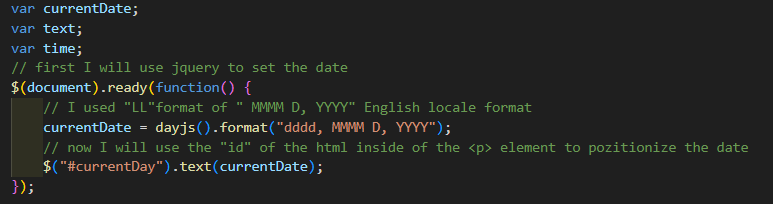
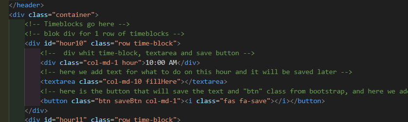
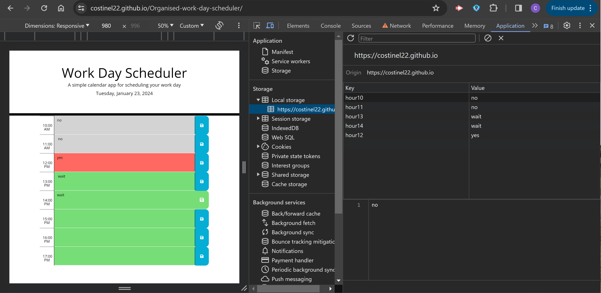
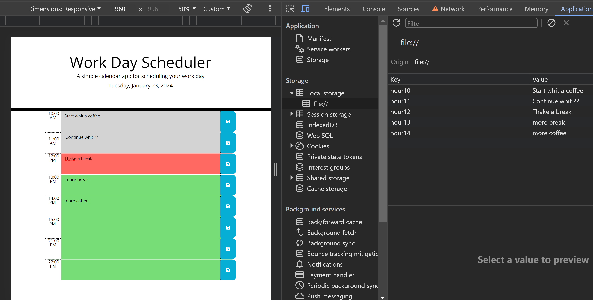

# Organised-work-day-scheduler
How to make a work day more productive.
## Description

- This project it help me to understand how  jquery works.
- This small project will help me and others to make a day more successful, adding a scheduling solution for the time working day.
- I learned how how to use vanilla JavaScript combined with jQuery.

## Installation

https://costinel22.github.io/Organised-work-day-scheduler/

#### Open source project,
 - open Instructions,
 -  go to Application, 
 - open Local storage, 
 - into the scheduler project a few informations and save them,
 - look at the local storage and see what's there sawed.

## Usage

##### Format date (curent date)
 

 #### HTML timetable format
 

##### Debugging and testing functions
 
## Credits
#### Date day.js where it ca finds more formatings
https://day.js.org/docs/en/display/format

#### The image for save button whit more variants it can be found in the link below.
https://www.w3schools.com/icons/tryit.asp?icon=fas_fa-save&unicon=f0c7

#### With the following class "btn" options the button will be highlighted
https://getbootstrap.com/docs/5.3/components/buttons/#base-class

#### This is a good example to remove and add classes using if statements
https://stackoverflow.com/questions/20882528/jquery-change-table-cell-color-if-clicked-and-clicked-again

## License

MIT License

## Tests
#### Tests on local host, from VSCode on crome.
 